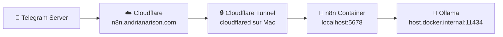
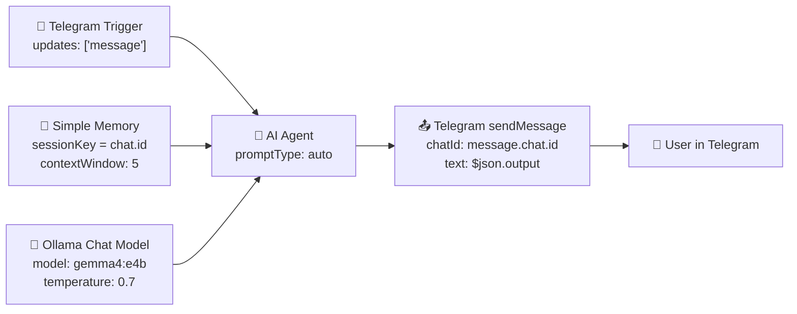

# Plan: Telegram → Ollama (gemma4:e4b) → Telegram Chatbot Workflow

## Overview

Create an n8n workflow that:
1. Listens for incoming Telegram messages via the **Telegram Trigger**
2. Passes the message text to an **AI Agent** using the **Ollama Chat Model** (`gemma4:e4b`)
3. Maintains conversation context via **Simple Memory** (per-chat session)
4. Sends the LLM's response back to the user via **Telegram (sendMessage)**

---

## Part 1: Docker & Network Configuration

### Current State
- n8n container runs on `bridge` network, port `5678` exposed to `localhost:5678`
- Only accessible locally — Telegram cannot reach it

### Target Architecture



### Step 1: Create `docker-compose.yml`

Replace the current `docker run` with a proper `docker-compose.yml`:

```yaml
version: '3.8'

services:
  n8n:
    image: docker.n8n.io/n8nio/n8n:latest
    container_name: n8n
    restart: unless-stopped
    ports:
      - "127.0.0.1:5678:5678"   # ← Local only, Cloudflare Tunnel y accède
    environment:
      # URL publique pour les webhooks Telegram
      - N8N_EDITOR_BASE_URL=https://n8n.andrianarison.com
      - WEBHOOK_URL=https://n8n.andrianarison.com/
      # Sécurité
      - N8N_SECURE_COOKIE=false  # Déjà configuré
      # Timezone
      - GENERIC_TIMEZONE=Europe/Paris
    volumes:
      - n8n_data:/home/node/.n8n

volumes:
  n8n_data:
    external: true   # Réutilise le volume existant
```

**Important:** Le port est maintenant `127.0.0.1:5678:5678` au lieu de `0.0.0.0:5678:5678` — n8n n'est accessible que depuis votre Mac, pas depuis le réseau local. Cloudflare Tunnel y accède via `localhost`.

### Step 2: Installer Cloudflare Tunnel

```bash
# 1. Télécharger cloudflared sur macOS
brew install cloudflared

# 2. Connecter votre domaine Cloudflare
cloudflared tunnel login
# → Cela ouvre un navigateur, connectez-vous à Cloudflare et autorisez andrianarison.com

# 3. Créer un tunnel
cloudflared tunnel create n8n-tunnel
# → Un ID de tunnel est créé (ex: 6ff42ae2-765d-4adf-8112-31c55c1551ef)

# 4. Créer le fichier de config ~/.cloudflared/config.yml
```

**Fichier `~/.cloudflared/config.yml` :**
```yaml
tunnel: 6ff42ae2-765d-4adf-8112-31c55c1551ef
credentials-file: /Users/ericandrianarison/.cloudflared/6ff42ae2-765d-4adf-8112-31c55c1551ef.json

ingress:
  - hostname: n8n.andrianarison.com
    service: http://localhost:5678
  - service: http_status:404
```

### Step 3: Configurer DNS dans Cloudflare Dashboard

1. Allez sur https://dash.cloudflare.com
2. Sélectionnez `andrianarison.com`
3. Allez dans **DNS** → **Records**
4. Ajoutez un enregistrement :
   - **Type:** `CNAME`
   - **Name:** `n8n`
   - **Target:** `6ff42ae2-765d-4adf-8112-31c55c1551ef.cfargotunnel.com`
   - **Proxy status:** ✅ Orange cloud (Proxied)

### Step 4: Démarrer le tunnel

```bash
# Démarrer le tunnel (en arrière-plan)
cloudflared tunnel run n8n-tunnel &

# Ou le configurer comme service macOS pour qu'il démarre automatiquement
cloudflared service install
```

### Step 5: Redémarrer n8n avec docker-compose

```bash
# Arrêter l'ancien conteneur
docker stop n8n
docker rm n8n

# Démarrer avec docker-compose
cd /Volumes/Public/Hobbies/VibeCoding/n8nMailManagement
docker compose up -d
```

---

## Part 2: Workflow Architecture



### Node Details

| Node | Type | Key Config |
|------|------|------------|
| **Telegram Trigger** | `n8n-nodes-base.telegramTrigger` v1.3 | `updates: ['message']` |
| **AI Agent** | `@n8n/n8n-nodes-langchain.agent` v3.1 | `promptType: 'auto'`, systemMessage instructing assistant |
| **Ollama Chat Model** | `@n8n/n8n-nodes-langchain.lmChatOllama` v1 | `model: 'gemma4:e4b'`, `temperature: 0.7` |
| **Simple Memory** | `@n8n/n8n-nodes-langchain.memoryBufferWindow` v1.4 | `sessionKey: nodeJson(telegramTrigger, 'message.chat.id')`, `contextWindowLength: 5` |
| **Telegram sendMessage** | `n8n-nodes-base.telegram` v1.2 | `chatId: nodeJson(telegramTrigger, 'message.chat.id')`, `text: expr('{{ $json.output }}')` |

### Credentials Used

| Credential | Type | Name in n8n |
|------------|------|-------------|
| Telegram Bot Token | `telegramApi` | "Telegram account" ✅ Existe |
| Ollama API | `ollamaApi` | "Ollama account" ✅ Existe |

---

## Part 3: Implementation Steps

1. ✅ **Plan approuvé**
2. ✅ **docker-compose.yml créé** dans le projet
3. ✅ **Workflow créé** dans n8n (ID: `E6zR3WkUfXjCdeE6`)
4. ⬜ **Migrer OVH → Cloudflare** (voir [`plans/guide-ovh-cloudflare.md`](plans/guide-ovh-cloudflare.md))
   - Désactiver DNSSEC chez OVH
   - Changer les serveurs DNS OVH → Cloudflare
   - Attendre la propagation
5. ⬜ **Installer le tunnel Cloudflare** (étapes 7-9 du guide)
6. ⬜ **Redémarrer n8n** avec docker-compose
7. ⬜ **Activer le workflow** et tester

---

## Étapes détaillées post-Cloudflare

### Installer le tunnel
```bash
brew install cloudflared
cloudflared tunnel login
cloudflared tunnel create n8n-tunnel
# → Note l'ID du tunnel (ex: 6ff42ae2-765d-4adf-8112-31c55c1551ef)
```

### Configurer le tunnel
Crée `~/.cloudflared/config.yml` :
```yaml
tunnel: TON_ID_DU_TUNNEL
credentials-file: /Users/ericandrianarison/.cloudflared/TON_ID_DU_TUNNEL.json

ingress:
  - hostname: n8n.andrianarison.com
    service: http://localhost:5678
  - service: http_status:404
```

### Ajouter l'enregistrement DNS dans Cloudflare
- **Type:** CNAME | **Name:** n8n | **Target:** `TON_ID.cfargotunnel.com` | **Proxy:** ✅ Orange

### Démarrer le tunnel
```bash
cloudflared tunnel run n8n-tunnel &
```

### Activer le workflow dans n8n
- Va dans n8n → Workflows → "Telegram Ollama Chatbot" → Toggle **Active** ON

### Tester
Envoie un message à ton bot Telegram 🎉

---

## Vérification finale

Une fois tout configuré :
1. Envoyez un message à votre bot Telegram
2. n8n reçoit le webhook sur `https://n8n.andrianarison.com/webhook/...`
3. L'AI Agent appelle Ollama (`gemma4:e4b`) via `host.docker.internal:11434`
4. La réponse est renvoyée dans Telegram